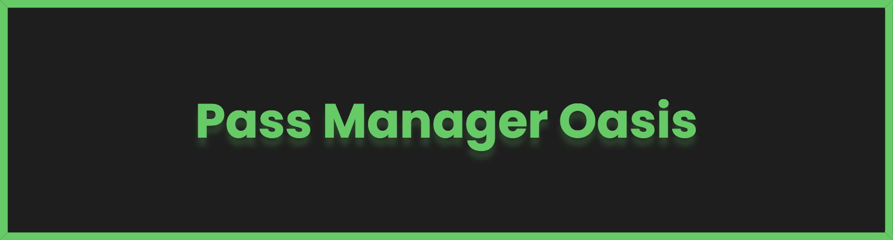

<h1 align="center">Pass Manager Oasis</h1>
<h4 align="center">A transparent and open-source password management multitool</h4>

  
  
  

  <a href="#introduction">Introduction</a> •
  <a href="#installation">Installation</a> •
  <a href="#features">Features</a> •
  <a href="#resources">Resources</a> •
  <a href="#guides">Guides</a> •
  <a href="#faq">FAQ</a> •
  <a href="#contributors">Contributors</a> •
  <a href="#credits">Credits</a> •
  <a href="#useful-links">Useful Links</a>

# Introduction

### 1. What is PMO?

- Pass Manager Oasis (PMO) is a password manager application developed by a small team of eager developers who want to make a significant improvement in your password and data security.

### 2. Purpose and goals

- Our main goal is providing and maintaining a **secure** and **trustworthy** environment for the user.

### 3. What makes PMO different from other Password Managers, and why should you use it?

With PMO we aim to avoid some of the industry standards that would make our services feel corporate, lazy or greedy:

- We provide maximum **security** and **comfort** instead of insecure practices which could lead to your sensitive data being leaked **_1_**.
- We follow a **Zero-Knowledge Architecture** meaning **no one** (not even us) has the possibility to access your encrypted data, only yourself! 
- No suspicious activity on your devices.
- Cross-platform support and availability.
- Universal design (UX/UI) **_2_**.
- No scummy subscription-based purchases or trials.
- Full community support.
- Fully anonymous accounts, only there for the user to access their data.
- Both in-app and server-side multistep encryption.
- If there are any issues on our end (server breach/data leak) any leaked data will be virtually unusable.
- Regular non-disruptive server maintenance to ensure data security.
- **Fully open-source** so you know ***exactly*** how your data is being handled!
  
### 4. Pricing

- Good news is, you get this package entirely for free! All you need is a valid email address, and you're good to go.
- Some features will be only available for Oasis Premium **_3_**. users. These features aren't considered necessary for the base product, but are very resource dependant, which is why buying them is a good way of supporting this project. It's a win-win!

### 5. Community

- Communication is important. That's why the user will have many different ways to give feedback and criticism directly to us, including in-app reports and external discussion channels. Communication will be completely anonymous, which we believe will help establish a positive, dedicated and honest community.

# Installation
# Features
# Resources
# Guides
# FAQ
# Contributors
# Credits
# Useful Links

<!-- > [!NOTE]  
> Highlights information that users should take into account, even when skimming.

> [!TIP]
> Optional information to help a user be more successful.

> [!IMPORTANT]  
> Crucial information necessary for users to succeed.

> [!WARNING]  
> Critical content demanding immediate user attention due to potential risks.

> [!CAUTION]
> Negative potential consequences of an action.
